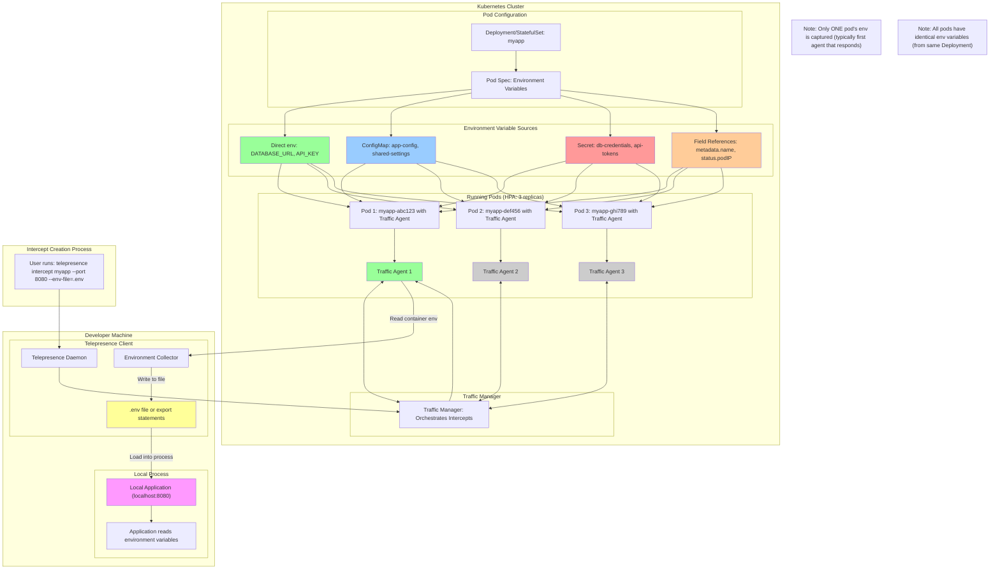
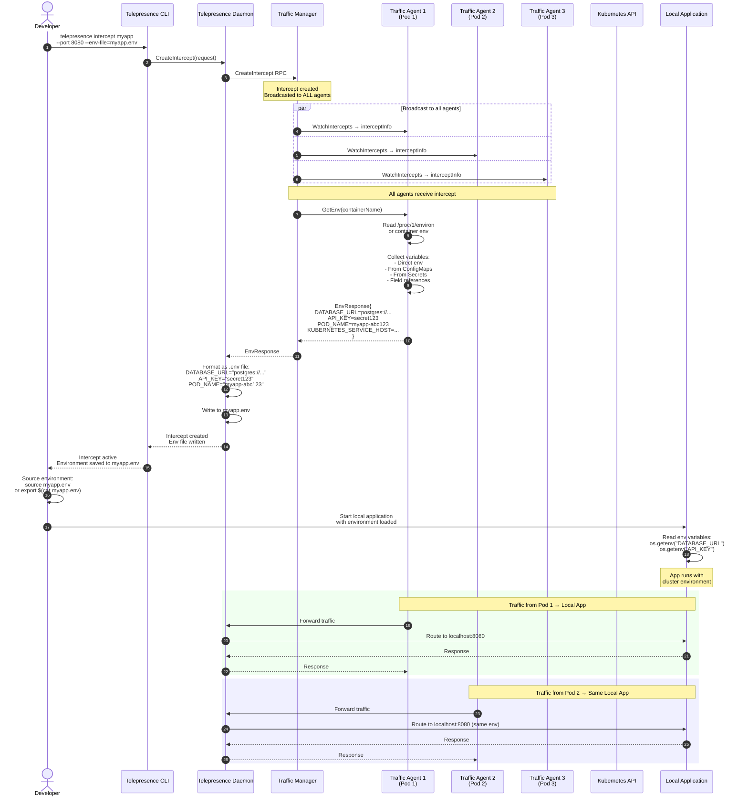
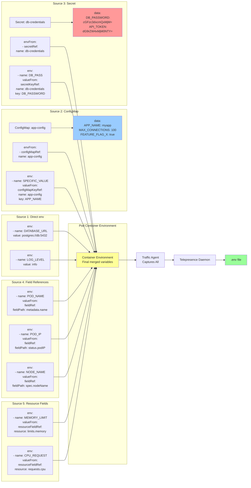
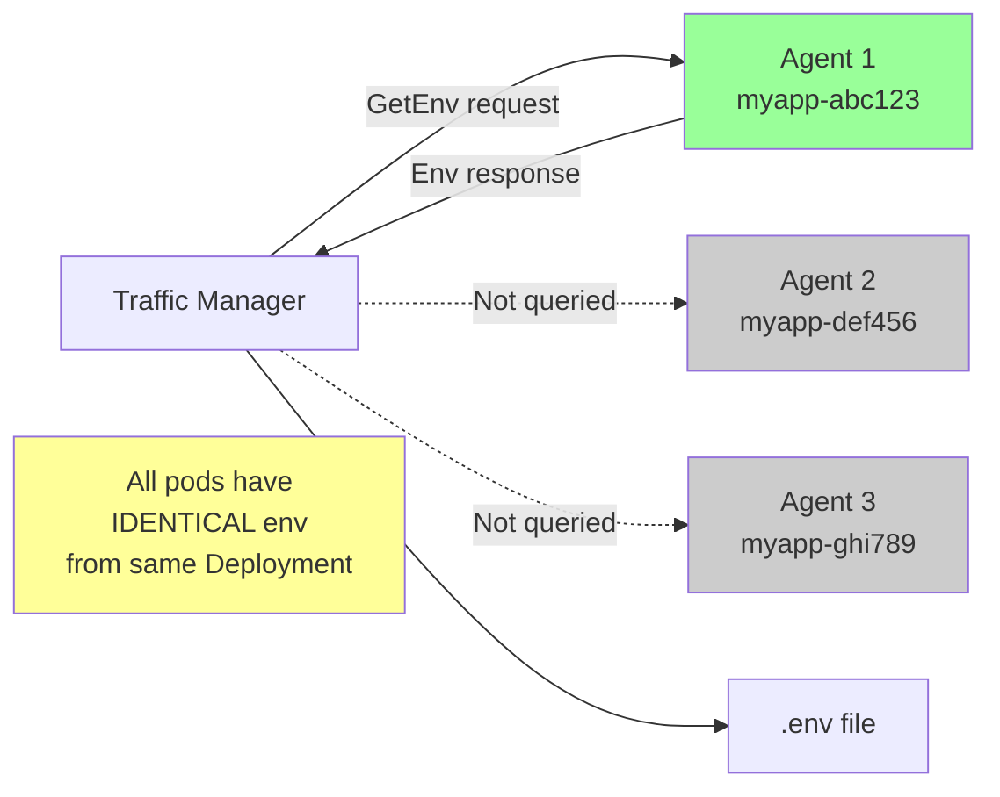
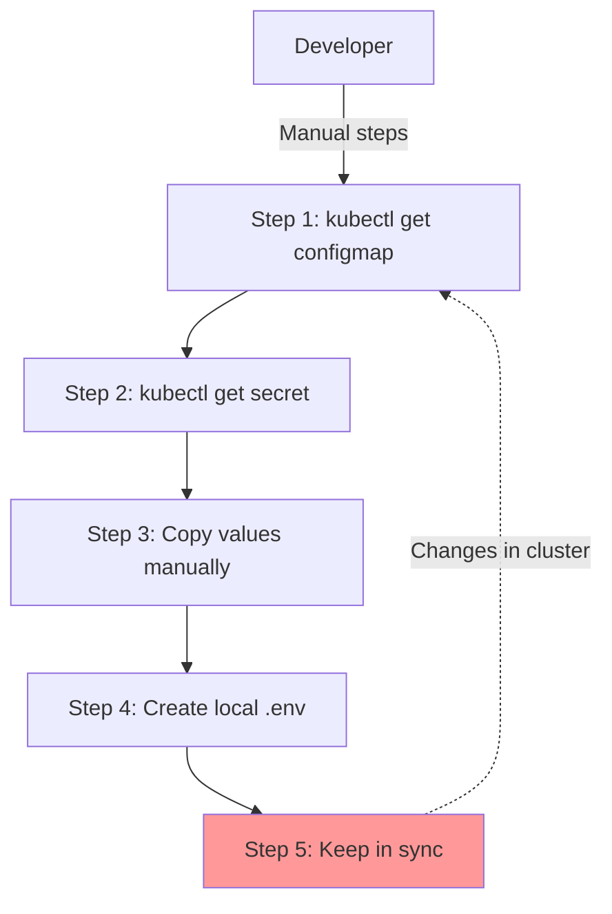
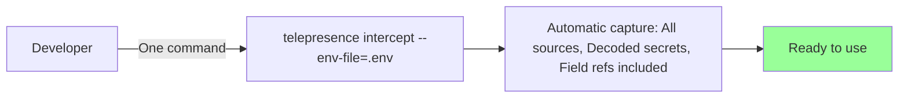

---
{"dg-publish":true,"permalink":"/displate/telepresence/telepresence-environment-variables/","tags":["telepresence"]}
---

# Telepresence Environment Variable Injection

This document explains how Telepresence captures environment variables from cluster pods and makes them available to your local development environment.

---

## Overview

When you create an intercept, Telepresence can automatically capture the environment variables from the intercepted pod's containers and inject them into your local process. This ensures your local development environment matches the cluster configuration.

---

## 1. Environment Variable Flow Architecture

This diagram shows the complete flow of environment variables from cluster pods to your local machine.



**Key Points:**
- Environment variables come from multiple sources (direct, ConfigMaps, Secrets, field refs)
- **Only ONE pod's environment** is captured (typically the first agent that responds)
- Since all pods in the same Deployment have **identical environment variables**, this is sufficient
- Variables are written to a file (`.env` format or shell export format)
- Your local app loads these variables at startup

---

## 2. Environment Variable Capture Sequence

This sequence diagram shows the step-by-step process of capturing and injecting environment variables.



**Process Steps:**
1. User requests intercept with `--env-file` flag
2. Traffic Manager creates intercept (broadcasted to all agents)
3. Traffic Manager requests environment variables from ONE agent (typically first responder)
4. Agent reads container's environment (all sources combined)
5. Agent returns environment variables to Traffic Manager
6. Traffic Manager forwards to Telepresence Daemon
7. Daemon writes variables to specified file (`.env` format)
8. Developer sources the file or loads it into local process
9. Local application runs with cluster environment variables
10. All intercepted traffic (from all pods) goes to the same local app with same environment

---

## 3. Environment Variable Sources Detail

This diagram breaks down the different sources of environment variables in Kubernetes pods.



**Captured Variables Include:**
- ✅ Direct `env` values
- ✅ All keys from `envFrom.configMapRef`
- ✅ All keys from `envFrom.secretRef`
- ✅ Specific keys from `configMapKeyRef`
- ✅ Specific keys from `secretKeyRef`
- ✅ Field references (pod name, IP, node, namespace)
- ✅ Resource field references (limits, requests)
- ✅ Kubernetes-injected variables (SERVICE_HOST, SERVICE_PORT)

---

## 4. Usage Examples

### Example 1: Basic Environment Capture

```bash
# Create intercept and save environment to file
telepresence intercept myapp --port 8080 --env-file=myapp.env

# File contents (myapp.env):
# DATABASE_URL="postgres://postgres:5432/mydb"
# REDIS_URL="redis://redis:6379"
# API_KEY="secret123"
# LOG_LEVEL="info"
# POD_NAME="myapp-abc123"
# POD_IP="10.244.1.5"

# Load environment and run local app
source myapp.env
python app.py

# Or use with docker-compose
docker-compose --env-file myapp.env up
```

### Example 2: JSON Format

```bash
# Get environment in JSON format
telepresence intercept myapp --port 8080 --env-json=myapp.json

# File contents (myapp.json):
# {
#   "DATABASE_URL": "postgres://postgres:5432/mydb",
#   "REDIS_URL": "redis://redis:6379",
#   "API_KEY": "secret123",
#   "LOG_LEVEL": "info",
#   "POD_NAME": "myapp-abc123",
#   "POD_IP": "10.244.1.5"
# }

# Use with tools that accept JSON config
```

### Example 3: Docker Integration

```bash
# Capture environment
telepresence intercept myapp --port 8080 --env-file=cluster.env

# Run local container with cluster environment
docker run --env-file cluster.env -p 8080:8080 myapp:latest
```

### Example 4: Programming Language Integration

**Python:**
```python
# Load .env file using python-dotenv
from dotenv import load_dotenv
import os

load_dotenv('myapp.env')

database_url = os.getenv('DATABASE_URL')
api_key = os.getenv('API_KEY')
```

**Node.js:**
```javascript
// Load .env file using dotenv
require('dotenv').config({ path: 'myapp.env' });

const databaseUrl = process.env.DATABASE_URL;
const apiKey = process.env.API_KEY;
```

**Go:**
```go
// Load .env file using godotenv
import "github.com/joho/godotenv"

godotenv.Load("myapp.env")

databaseUrl := os.Getenv("DATABASE_URL")
apiKey := os.Getenv("API_KEY")
```

---

## 5. Important Considerations

### Which Pod's Environment is Captured?



**Key Points:**
- Only **one agent** is queried for environment variables (typically the first to respond)
- This is **sufficient** because all pods in the same Deployment/StatefulSet have identical environment variables
- Pod-specific variables (like `POD_NAME`, `POD_IP`) will be from that one pod
- If you need different pod's environment, you can specify with `--agent-name` flag

### Environment Variable Precedence

When you run your local app:

1. **Local system environment** (existing variables on your machine)
2. **Loaded .env file** (from `--env-file`)
3. **Explicit exports** (if you manually set variables)

Use `export $(cat myapp.env | xargs)` to override local variables with cluster values.

### Security Considerations

⚠️ **Important Security Notes:**

1. **Secrets in .env files**: The `.env` file contains decoded secrets (not base64)
2. **File permissions**: Ensure `.env` files have restricted permissions (`chmod 600`)
3. **Git ignore**: Add `.env` to `.gitignore` to avoid committing secrets
4. **Cleanup**: Delete `.env` files after development sessions

```bash
# Set proper permissions
chmod 600 myapp.env

# Add to .gitignore
echo "*.env" >> .gitignore

# Cleanup after session
telepresence leave
rm myapp.env
```

---

## 6. Comparison with Other Approaches

### Without Telepresence Environment Injection



**Problems:**
- ❌ Manual, error-prone process
- ❌ Secrets need manual base64 decoding
- ❌ No automatic sync with cluster changes
- ❌ Field references (POD_NAME, etc.) hard to replicate

### With Telepresence Environment Injection



**Benefits:**
- ✅ Single command
- ✅ Automatic collection from all sources
- ✅ Secrets automatically decoded
- ✅ Field references automatically resolved
- ✅ Always in sync with cluster

---

## Summary

**Environment Variable Injection provides:**

1. **Automatic Capture**: All environment variables from all sources
2. **Multiple Formats**: `.env` files, JSON, or direct export
3. **Decoded Secrets**: No manual base64 decoding needed
4. **Field References**: Pod name, IP, node name automatically included
5. **Development Parity**: Your local app runs with exact cluster configuration
6. **Simple Integration**: Works with Docker, docker-compose, and all programming languages

**Typical Workflow:**

```bash
# 1. Create intercept with environment capture
telepresence intercept myapp --port 8080 --env-file=myapp.env

# 2. Load environment
source myapp.env

# 3. Run local app (now has cluster config)
npm start
# or
python app.py
# or
docker-compose up

# 4. Develop and test with production-like config

# 5. Clean up
telepresence leave
rm myapp.env
```