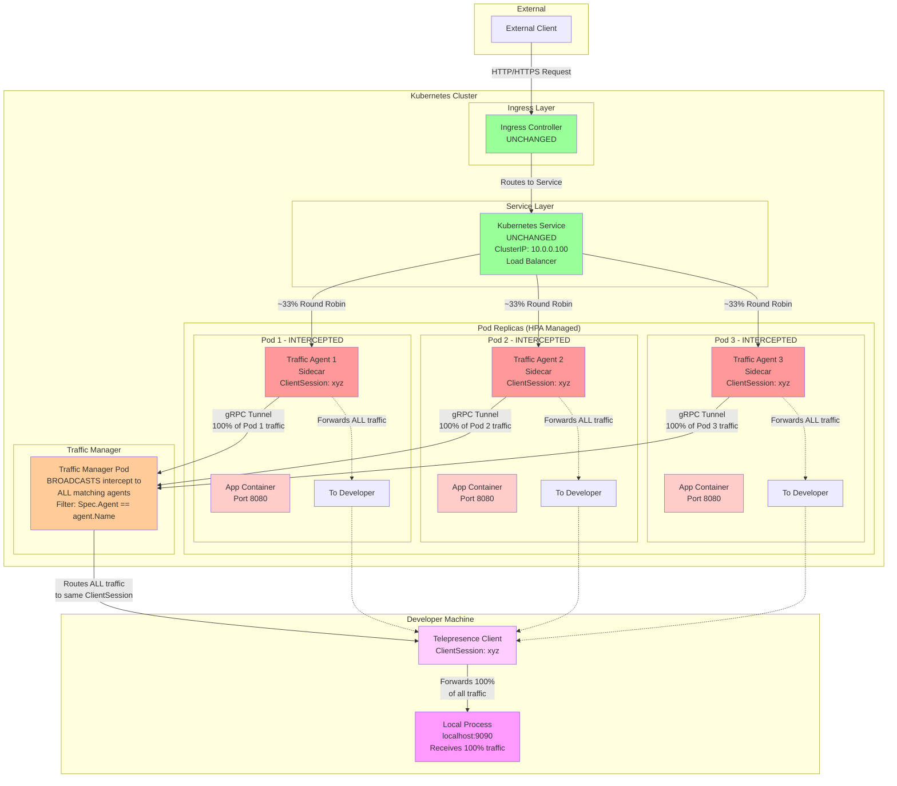
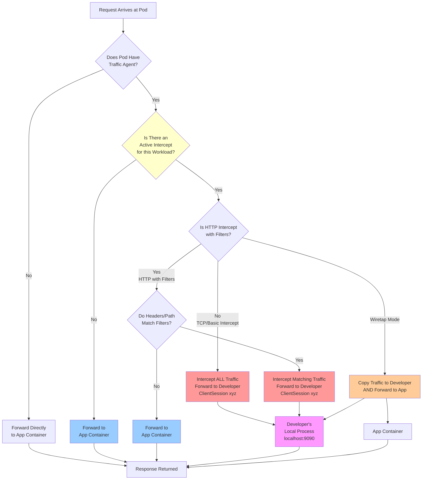
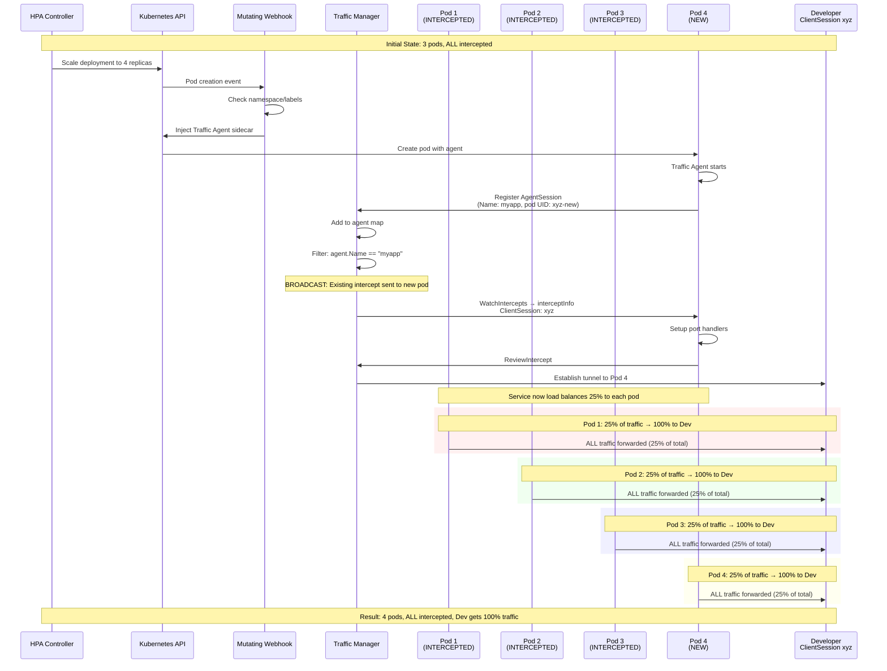
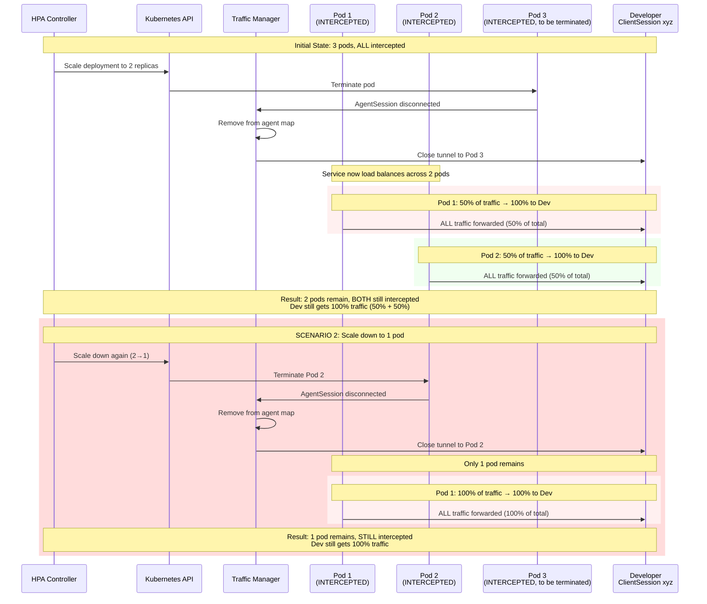
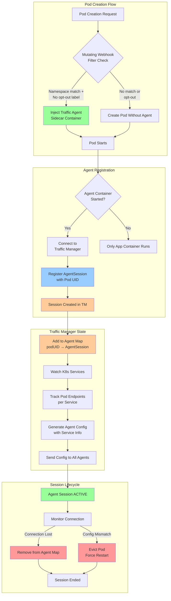
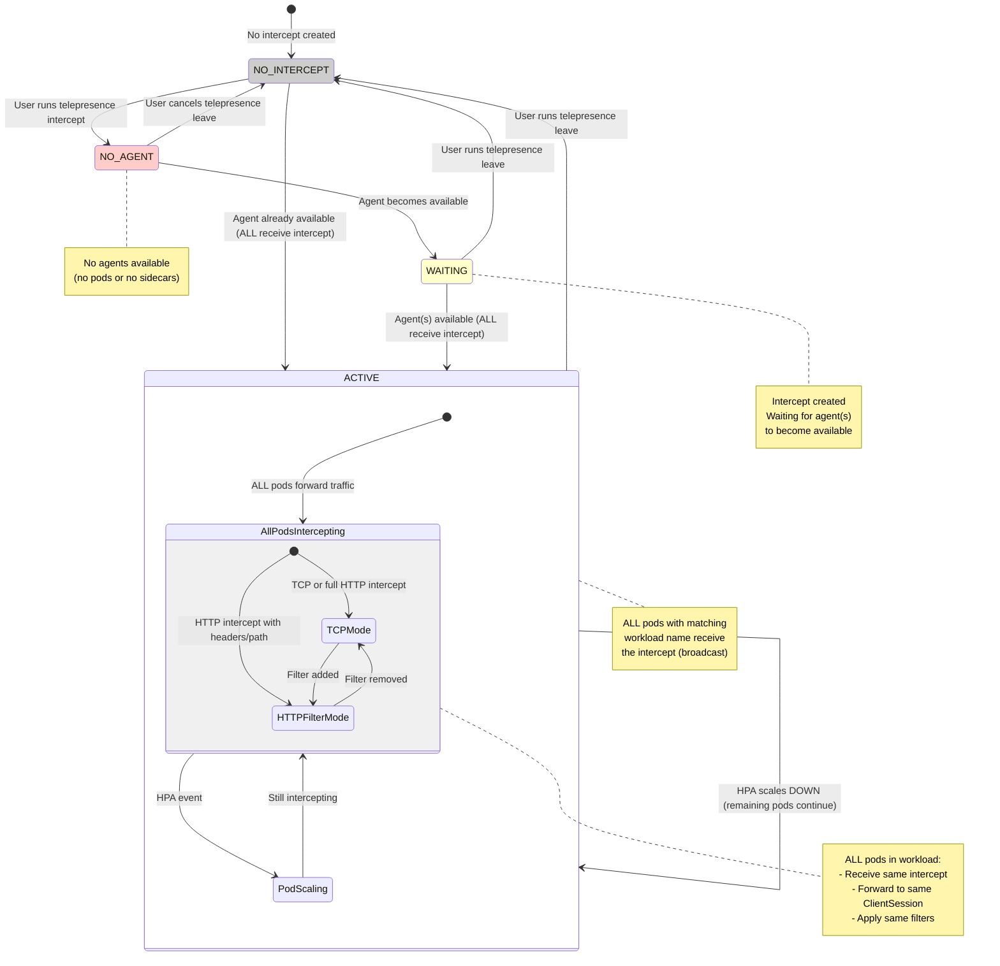
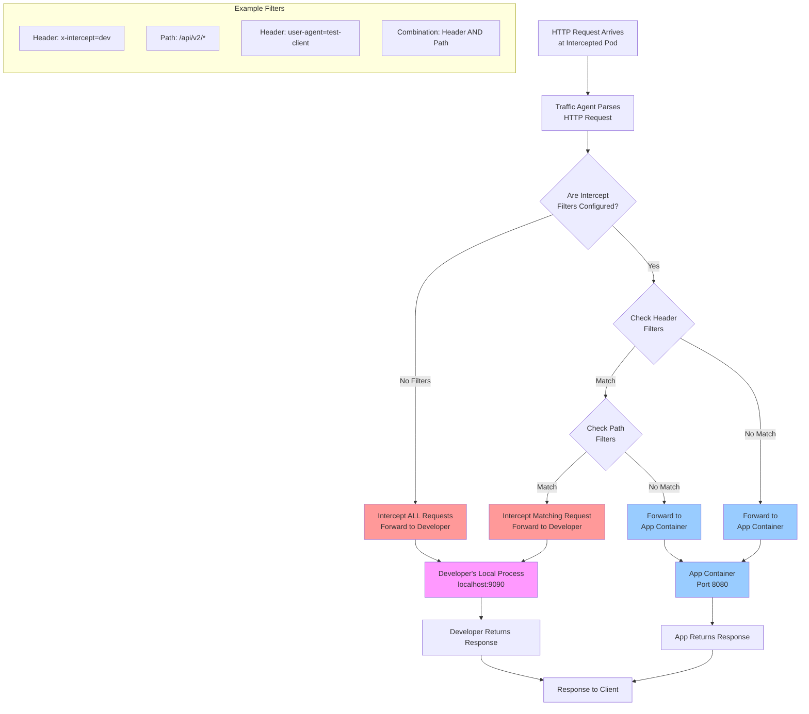
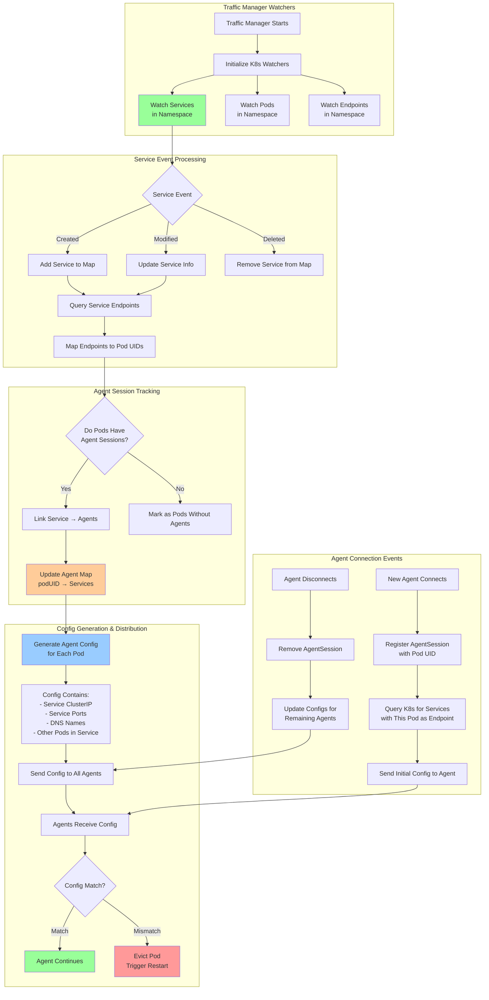
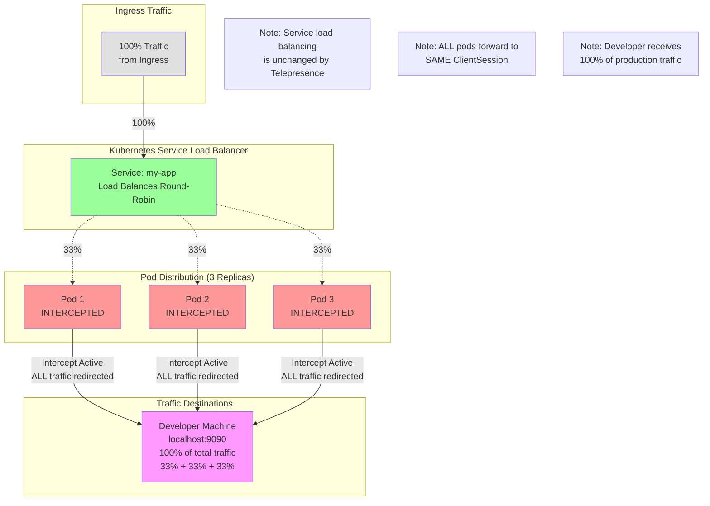
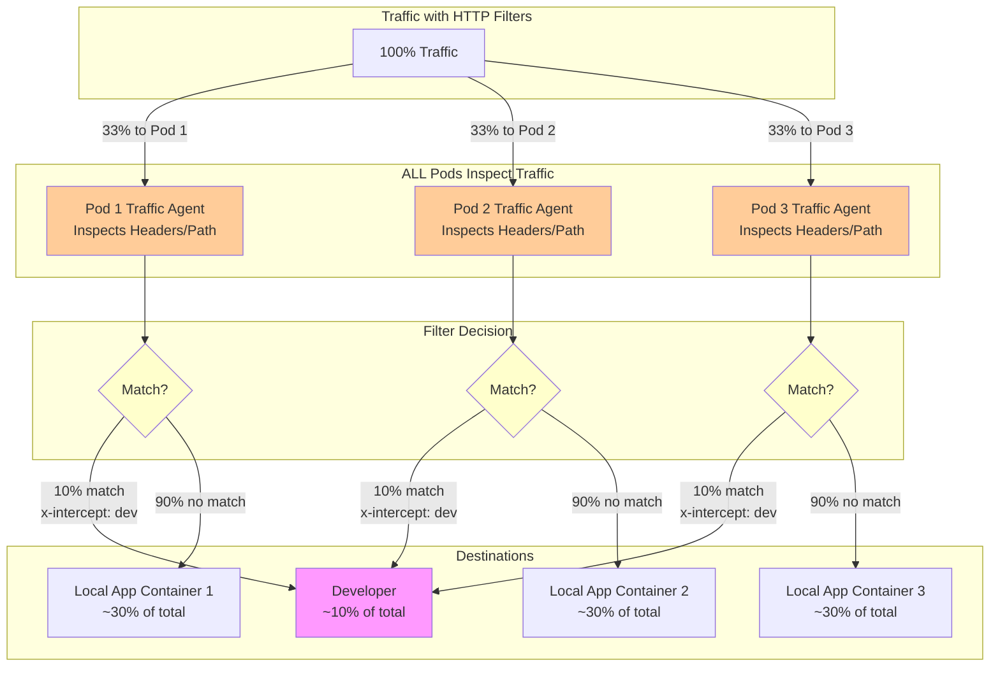

---
{"dg-publish":true,"permalink":"/displate/telepresence/telepresence-hpa-and-ingress-architecture-diagrams/"}
---

# Telepresence HPA + Ingress Architecture Diagrams

This post provides comprehensive visualizations of how Telepresence handles Horizontal Pod Autoscaler (HPA) scenarios with Ingress traffic.

---

## 1. Overall Architecture Diagram

This diagram shows the complete flow from external clients through Ingress to multiple pod replicas. **ALL pods intercept traffic and forward to the same developer machine.**

**Key Points:**
- Service and Ingress are **NOT modified** by Telepresence
- All pods have Traffic Agent sidecars injected via mutating webhook
- **ALL pods have active intercepts** (all red)
- All agents share the **same ClientSession ID** (xyz)
- Traffic Manager **broadcasts** the intercept to ALL matching agents
- Service load-balances ~33% to each pod
- Each pod forwards 100% of its received traffic to developer
- **Result: Developer receives 100% of total traffic (33% + 33% + 33%)**

---

## 2. Traffic Flow Decision Diagram

This flowchart shows the decision logic when a request arrives at a pod with a Traffic Agent. **All pods in the workload have active intercepts.**

**Key Decision Points:**
1. **Agent Check**: Only pods with agents can intercept
2. **Active Intercept for Workload**: Checks if there's an active intercept for the entire workload (not individual pod)
3. **Intercept Type**: TCP/Basic intercepts forward ALL traffic, HTTP intercepts can filter
4. **HTTP Filters**: Optional header/path matching for selective interception (applies to all pods)
5. **Wiretap Mode**: Special mode that copies traffic without disrupting normal flow
6. **All Pods Process Same Logic**: Every pod with an agent makes the same decisions

---

## 3a. HPA Scale UP Scenario (3→4 Pods)

This sequence diagram shows what happens when HPA scales up the deployment. **ALL pods receive the intercept via broadcast.**

**Key Behaviors:**
- New pod automatically gets Traffic Agent via mutating webhook
- Agent registers with Traffic Manager using **workload name** ("myapp")
- Traffic Manager's filter matches: `agent.Name == "myapp"`
- **Existing intercept is BROADCASTED to new pod** (same as other pods)
- New pod receives **same ClientSession ID** as other pods
- Service load-balances 25% to each pod (25%)
- **Developer still receives 100% of total traffic** (25% + 25% + 25% + 25%)
- No disruption to active intercept

---

## 3b. HPA Scale DOWN Scenario (3→2 Pods)

This sequence diagram shows what happens when HPA scales down. **ALL remaining pods continue to intercept.**

**Key Behaviors:**
- When pod is terminated, its tunnel is closed
- **ALL remaining pods STILL have active intercepts**
- Intercept does **NOT enter WAITING state** (other pods still active)
- Traffic Manager simply removes terminated pod from agent map
- Remaining pods continue forwarding **100% of their traffic** to developer
- **Developer still receives 100% of total production traffic**
- Service load-balances across fewer pods (50% each with 2 pods, 100% with 1 pod)
- No interruption to intercept - seamless continuation with remaining pods
- The intercept only ends when **ALL pods are gone** or user runs `telepresence leave`

---

## 4. Agent Injection & Session Management

This diagram shows how agents are injected and how sessions are managed.

**Key Concepts:**
- **Mutating Webhook**: Intercepts pod creation, injects agent sidecar
- **Pod UID**: Unique identifier used to track each agent session
- **Agent Map**: Traffic Manager maintains map of all active agent sessions (keyed by workload name)
- **Service Watching**: TM tracks which pods are endpoints for which services
- **Config Sync**: All agents receive updated configs when services change
- **Eviction**: Pods with mismatched configs are evicted and restarted
- **Intercept Broadcast**: When an agent registers, if there's an existing intercept for its workload name, it immediately receives it via `WatchIntercepts`

---

## 5. Intercept Lifecycle with Multiple Pods

This state diagram shows how an intercept transitions between states. **ALL pods receive the intercept via broadcast mechanism.**

**State Descriptions:**

1. **NO_INTERCEPT**: Default state, no intercept created
2. **NO_AGENT**: Intercept requested but no agents available (no pods with sidecars)
3. **WAITING**: Intercept created, waiting for agent(s) to become available
4. **ACTIVE**: One or more agents available, **ALL matching agents receive and handle the intercept**
   - The intercept object exists in Traffic Manager
   - The `WatchIntercepts` filter broadcasts it to ALL agents where `agent.Name == Spec.Agent`
   - ALL agents forward their traffic to the same `ClientSession.SessionId`
   - HPA scale up/down does NOT change state (remains ACTIVE with different number of pods)
   - Sub-states for full vs filtered HTTP interception

**Transitions:**
- HPA scale UP: Stays in ACTIVE (new pod receives broadcast intercept)
- HPA scale DOWN: Stays in ACTIVE (remaining pods continue intercepting)
- User runs `telepresence leave`: ACTIVE → NO_INTERCEPT (all pods stop intercepting)

---

## 6. HTTP Intercept Filtering

This flowchart shows how HTTP header/path filtering works for selective interception.

**Filter Types:**
- **Header Filters**: Match specific HTTP headers (e.g., `x-intercept: dev`)
- **Path Filters**: Match URL paths with wildcards (e.g., `/api/v2/*`)
- **Combined Filters**: Both header AND path must match

**Use Cases:**
1. **Dev Environment Testing**: Only intercept requests with specific headers
2. **API Version Testing**: Only intercept specific API versions
3. **User Simulation**: Only intercept traffic from test users
4. **Partial Migration**: Test new code with subset of production traffic

**Benefits:**
- Same pod handles both intercepted and normal traffic
- No need to modify load balancer or routing rules
- Allows A/B testing and gradual rollouts
- Production traffic continues unaffected

---

## 7. Service + Endpoint Tracking

This diagram shows how Traffic Manager watches services and manages agent configurations.

**Key Processes:**

1. **Service Watching**:
   - Traffic Manager watches all Services in the namespace
   - Tracks which pods are endpoints for each service
   - Updates when services are created, modified, or deleted

2. **Agent Session Tracking**:
   - Each agent registers with unique pod UID
   - TM maintains bidirectional map: Service <-> Agents
   - Links services to the agents running in their endpoint pods

3. **Config Generation**:
   - Each agent receives config with:
     - All services it's an endpoint for
     - ClusterIPs and ports
     - DNS names
     - List of other pods in the same service
   - Config regenerated when services or endpoints change

4. **Config Validation**:
   - Agents compare received config with their current state
   - **Mismatch Detection**: If pod's actual services don't match config
   - **Eviction**: Pod is evicted and restarted to resync
   - Prevents stale state and ensures consistency

5. **Dynamic Updates**:
   - New agent connects → Get current service state
   - Service changes → All affected agents get new config
   - Agent disconnects → Other agents notified of endpoint change

---

## 8. Traffic Distribution Visualization

This diagram shows how traffic is distributed across pods with a basic intercept active. **ALL pods intercept and forward to the developer.**

### Traffic Distribution Table

**For TCP/Basic Intercepts (no HTTP filtering):**

| Scenario | Total Pods | Intercepted Pods | Traffic to Developer | Traffic to Cluster |
|----------|-----------|------------------|---------------------|-------------------|
| 1 pod    | 1         | 1 (100%)         | 100%                | 0%                |
| 2 pods   | 2         | 2 (100%)         | 100%                | 0%                |
| 3 pods   | 3         | 3 (100%)         | 100%                | 0%                |
| 4 pods   | 4         | 4 (100%)         | 100%                | 0%                |
| 5 pods   | 5         | 5 (100%)         | 100%                | 0%                |

**Key Points:**
- Service load balancing is **unmodified** by Telepresence
- **ALL pods** in the workload receive the same intercept (broadcast mechanism)
- **ALL pods** forward 100% of their received traffic to developer
- Developer receives **100% of total production traffic**
- The number of replicas **does NOT affect** the percentage of traffic reaching developer
- **HTTP filtering** is the ONLY way to reduce traffic to developer

### With HTTP Filtering

**With Filters Example:**
- 3 pods, **ALL 3 intercepted**
- Filter: `x-intercept: dev` (matches 10% of requests)
- **ALL pods** inspect headers and apply the same filter
- Developer receives: (33% × 10%) + (33% × 10%) + (33% × 10%) = **10% of total traffic**
- Pod 1's app container: 33% × 90% = **29.7% of total traffic**
- Pod 2's app container: 33% × 90% = **29.7% of total traffic**
- Pod 3's app container: 33% × 90% = **29.7% of total traffic**
- **Total to developer: 10%**
- **Total to cluster: 90%**

---

## Summary: How Telepresence Handles HPA + Ingress

### What Telepresence Does NOT Modify:
**Service** - ClusterIP and load balancing unchanged
**Ingress** - Routing rules unchanged
**Endpoints** - Kubernetes endpoints list unchanged
**Network Policies** - Security policies unchanged

### What Telepresence DOES Modify:
**Pod Specs** - Injects Traffic Agent sidecar via mutating webhook
**Traffic Routing** - **ALL agents in the workload** intercept and forward traffic
**DNS Resolution** - Agents can proxy DNS for cluster awareness

### Key Behaviors with HPA:
1. **Scale UP**: New pods get agents, **ALL pods receive the same intercept** (broadcast)
2. **Scale DOWN**: Pods are removed but remaining pods continue intercepting
3. **Traffic Distribution**: Service load-balances across all pods (1/N per pod)
4. **Intercept Broadcast**: **ALL pods** in workload receive same intercept via `WatchIntercepts` filter
5. **Shared ClientSession**: **ALL agents** forward to the same ClientSession ID
6. **Result**: **100% of traffic reaches developer**
7. **HTTP Filtering**: The **ONLY way** to reduce traffic to developer
8. **Session Management**: Each pod's agent is tracked by unique pod UID
9. **Automatic Recovery**: Intercepts automatically restore after pod restarts

### Best Practices:
- **Use HTTP filtering** - Without it, developer receives **100% of production traffic**
- **Be careful** - Basic intercepts route ALL traffic to your machine
- Monitor **HPA metrics** - All intercepted pods still contribute to scaling decisions
- Consider **minimum replicas** >= 2 if using HTTP filtering for partial traffic
- **HTTP header/path filters** are essential for safety
